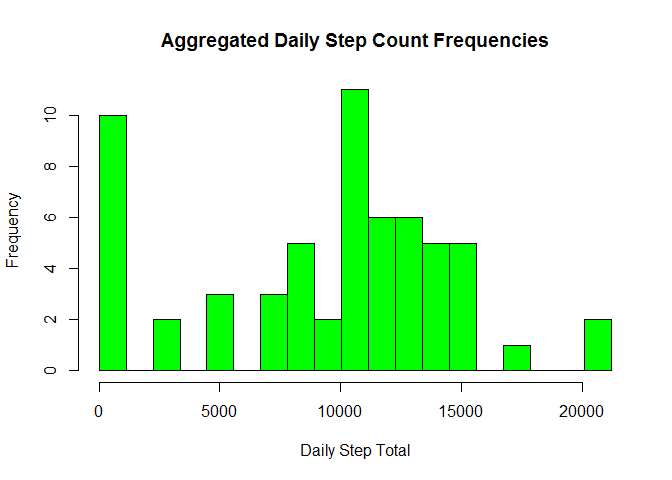
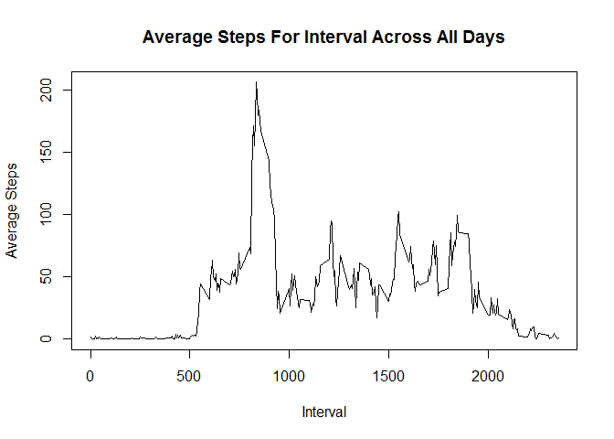
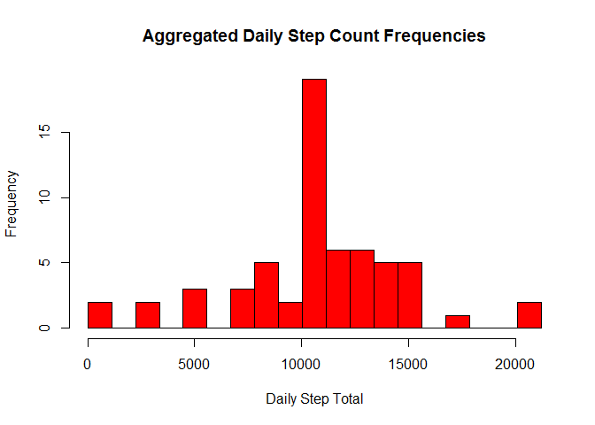
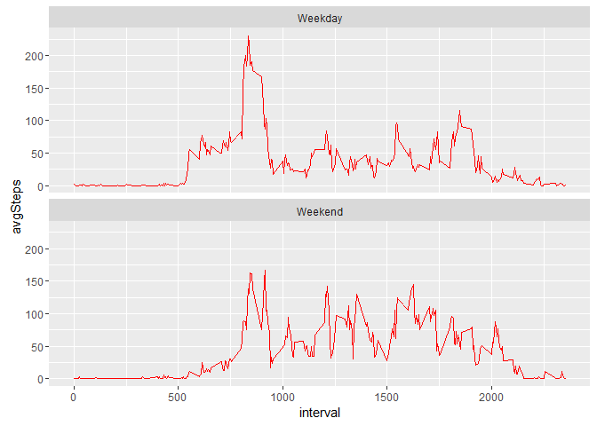

# Reproducible Research: Peer Assessment 1
Brian Werner  
January 8, 2016  
***
#Loading and preprocessing the data

##_Code to load and pre-process the data set. The data is quite tidy already and does not require much pre-processing. Ensured that the correct data types are being used for each column (Date for date and integer for the interval and steps columns)._


```r
library(dplyr)
```

```
## 
## Attaching package: 'dplyr'
```

```
## The following objects are masked from 'package:stats':
## 
##     filter, lag
```

```
## The following objects are masked from 'package:base':
## 
##     intersect, setdiff, setequal, union
```

```r
activity <- read.csv('activity.csv')
activity$date <- as.Date(activity$date)
activity$interval <- as.integer(activity$interval)
activity$steps <- as.integer(activity$steps)
head(activity)
```

```
##   steps       date interval
## 1    NA 2012-10-01        0
## 2    NA 2012-10-01        5
## 3    NA 2012-10-01       10
## 4    NA 2012-10-01       15
## 5    NA 2012-10-01       20
## 6    NA 2012-10-01       25
```

```r
tail(activity)
```

```
##       steps       date interval
## 17563    NA 2012-11-30     2330
## 17564    NA 2012-11-30     2335
## 17565    NA 2012-11-30     2340
## 17566    NA 2012-11-30     2345
## 17567    NA 2012-11-30     2350
## 17568    NA 2012-11-30     2355
```
***
#What is mean total number of steps taken per day?
##_Calculating the daily step totals. Ignore the NA values for now._


```r
dailies <- group_by(activity,date) %>% summarise(total=sum(steps,na.rm=TRUE))
head(dailies)
```

```
## Source: local data frame [6 x 2]
## 
##         date total
##       (date) (int)
## 1 2012-10-01     0
## 2 2012-10-02   126
## 3 2012-10-03 11352
## 4 2012-10-04 12116
## 5 2012-10-05 13294
## 6 2012-10-06 15420
```

```r
tail(dailies)
```

```
## Source: local data frame [6 x 2]
## 
##         date total
##       (date) (int)
## 1 2012-11-25 11834
## 2 2012-11-26 11162
## 3 2012-11-27 13646
## 4 2012-11-28 10183
## 5 2012-11-29  7047
## 6 2012-11-30     0
```

##_Production of a simple histogram of the total number of steps taken each day._


```r
hisIdx <- seq(0,to=max(dailies$total),length.out = 20)
hist(dailies$total, main="Aggregated Daily Step Count Frequencies", breaks=hisIdx,col='green', xlab = 'Daily Step Total')
```

\

##_Calculation of the mean and median of the total number of steps taken per day_


```r
mean(dailies$total)
```

```
## [1] 9354.23
```

```r
median(dailies$total)
```

```
## [1] 10395
```
##_Make a time series plot (i.e. type = "l") of the 5-minute interval (x-axis) and the average number of steps taken, averaged across all days (y-axis)_


```r
fiveMinInts <- group_by(activity,interval) %>% summarise(avgSteps = mean(steps,na.rm=TRUE))
head(fiveMinInts)
```

```
## Source: local data frame [6 x 2]
## 
##   interval  avgSteps
##      (int)     (dbl)
## 1        0 1.7169811
## 2        5 0.3396226
## 3       10 0.1320755
## 4       15 0.1509434
## 5       20 0.0754717
## 6       25 2.0943396
```

```r
tail(fiveMinInts)
```

```
## Source: local data frame [6 x 2]
## 
##   interval  avgSteps
##      (int)     (dbl)
## 1     2330 2.6037736
## 2     2335 4.6981132
## 3     2340 3.3018868
## 4     2345 0.6415094
## 5     2350 0.2264151
## 6     2355 1.0754717
```

```r
plot(fiveMinInts,type='l',main='Average Steps For Interval Across All Days',ylab = 'Average Steps', xlab = 'Interval')
```

\

##_Which 5-minute interval, on average across all the days in the dataset, contains the maximum number of steps?_


```r
arrange(fiveMinInts,desc(avgSteps))[1,]
```

```
## Source: local data frame [1 x 2]
## 
##   interval avgSteps
##      (int)    (dbl)
## 1      835 206.1698
```
***
#_Imputing missing values_

##_Note that there are a number of days/intervals where there are missing values (coded as NA). The presence of missing days may introduce bias into some calculations or summaries of the data._

##_Calculate and report the total number of missing values in the dataset (i.e. the total number of rows with NAs)_


```r
count(activity[!complete.cases(activity),])
```

```
## Source: local data frame [1 x 1]
## 
##       n
##   (int)
## 1  2304
```

##_Devise a strategy for filling in all of the missing values in the dataset. The strategy does not need to be sophisticated. For example, you could use the mean/median for that day, or the mean for that 5-minute interval, etc._
###For this I will utilise the mean for the particular 5-minute interval as already calculated in the fiveMinInts data frame. Best method I could determine was to convert the data frame to the data.table library and use in that form with the ifelse function to replace steps where is.na(steps) evaluates true.
##_Create a new dataset that is equal to the original dataset but with the missing data filled in._


```r
library(data.table)
```

```
## 
## Attaching package: 'data.table'
```

```
## The following objects are masked from 'package:dplyr':
## 
##     between, last
```

```r
activityDT <- data.table(activity)
#have no idea why this needs to be repeated to do every row...but it did for me while testing
while (count(activityDT[is.na(steps)]) > 0) {activityDT[is.na(steps),steps:= as.integer(round(fiveMinInts$avgSteps[fiveMinInts$interval==interval]))]}
#and to prove that this did its job...
count(activityDT[is.na(steps)])
```

```
## Source: local data table [1 x 1]
## 
##       n
##   (int)
## 1     0
```

```r
head(activityDT)
```

```
##    steps       date interval
## 1:     2 2012-10-01        0
## 2:     0 2012-10-01        5
## 3:     0 2012-10-01       10
## 4:     0 2012-10-01       15
## 5:     0 2012-10-01       20
## 6:     2 2012-10-01       25
```

##_Make a histogram of the total number of steps taken each day..._


```r
dailiesImpute <- group_by(activityDT,date) %>% summarise(total=sum(steps))
head(dailiesImpute)
```

```
##         date total
## 1 2012-10-01 10762
## 2 2012-10-02   126
## 3 2012-10-03 11352
## 4 2012-10-04 12116
## 5 2012-10-05 13294
## 6 2012-10-06 15420
```

```r
tail(dailiesImpute)
```

```
## Source: local data frame [6 x 2]
## 
##         date total
##       (date) (int)
## 1 2012-11-25 11834
## 2 2012-11-26 11162
## 3 2012-11-27 13646
## 4 2012-11-28 10183
## 5 2012-11-29  7047
## 6 2012-11-30 10762
```

```r
hisIdxI <- seq(0,to=max(dailiesImpute$total),length.out = 20)
hist(dailiesImpute$total,main="Aggregated Daily Step Count Frequencies",breaks=hisIdxI, col='red',xlab = 'Daily Step Total')
```

\

##_Calculate and report the mean and median total number of steps taken per day._


```r
mean(dailiesImpute$total)
```

```
## [1] 10765.64
```

```r
median(dailiesImpute$total)
```

```
## [1] 10762
```
##_Do these values differ from the estimates from the first part of the assignment? What is the impact of imputing missing data on the estimates of the total daily number of steps?_
###The imputed values appear to have a minimal effect on the computed mean or median values. Increasing the number of breaks in the histogram eventually does show a difference between the original data and the set with the imputed values; especially evenident in the bins for smaller step totals. Examining the data by hand shows some noticable differences in some days; especially those days that were completely NA in the original dataset.

***
#_Are there differences in activity patterns between weekdays and weekends?_

##_For this part the weekdays() function may be of some help here. Use the dataset with the filled-in missing values for this part._
##_Create a new factor variable in the dataset with two levels - "weekday" and "weekend" indicating whether a given date is a weekday or weekend day._

```r
activityDT[, weekday:=factor(ifelse(weekdays(date) %in% c("Saturday", "Sunday"), "Weekend", "Weekday"))]
```
##_Make a panel plot containing a time series plot (i.e. type = "l") of the 5-minute interval (x-axis) and the average number of steps taken, averaged across all weekday days or weekend days (y-axis). See the README file in the GitHub repository to see an example of what this plot should look like using simulated data._

```r
library(ggplot2)
group_by(activityDT,weekday,interval) %>% summarise(avgSteps=mean(steps)) %>% ggplot(aes(interval,avgSteps)) + geom_line(color='red') + facet_wrap(~weekday,ncol=1,nrow=2)
```

\
